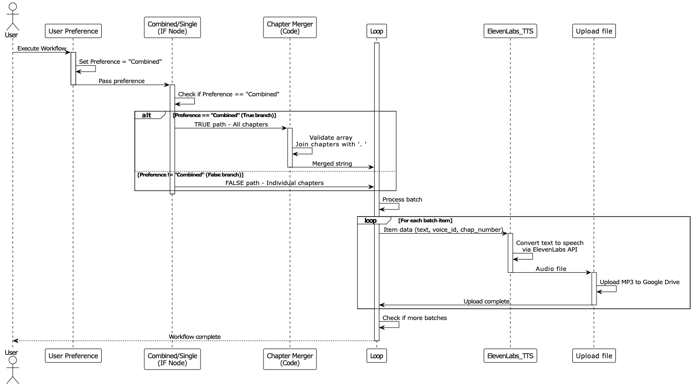

#

At ATM-Labs, we design intelligent automation workflows and AI agents that simplify complex, repetitive tasks so that your operations become faster, smoother, and more reliable every time.

We focus on building scalable, user-friendly systems that help businesses reduce manual work, minimize errors, and improve productivity. Whether it's process automation, AI-driven decision support, or custom workflow design, our solutions are tailored to fit real-world needs and grow with your business.

You can know more about us and our exeprtise using the links below:
- 🌐 **Website:** https://atm-labs.io  
- 📁 **Portfolio:** https://atm-labs.io/workflows

From idea to implementation, we turn complex processes into clean, repeatable systems that teams can use confidently again and again. If you want to make an automation system of your own, we can build that for you. You can contact us using the email below:
- 📩 **Contact:** workflow@atm-labs.com

# AI-Powered Audiobook Generator Workflow

This workflow transforms written ebook chapters into professionally narrated audiobook files using ElevenLab's AI voice synthesis.

Below is the sequence diagram showing how the system carries out this task.

## How It Works
This n8n automation converts text-based ebook content into high-quality audio narration using ElevenLabs' text-to-speech technology. Here's how the process unfolds:

**Set User Preferences:**  
The User Preference node establishes whether you want to generate a single combined audiobook file or separate audio files for each chapter. The default setting is "Combined" mode, which merges all chapters into one continuous narration.

**Retrieve Chapter Content:**  
The Get row(s) in sheet node connects to your Google Sheet containing the ebook chapters. This sheet should have chapter content stored with each row representing one chapter, making it easy to process content sequentially or all at once.

**Determine Processing Mode:**  
The Combined/Single node evaluates your preference setting and routes the workflow accordingly. If set to "Combined," it aggregates all chapters into a single audio file. If set to "Single," it processes each chapter individually for separate audio outputs.

**Aggregate Chapters (Combined Mode):**  
When operating in combined mode, the Aggregate node collects all chapter content from the Google Sheet into a single dataset, preparing it for unified processing.

**Merge Chapter Text:**  
The Chapter Merger node uses JavaScript to join all chapter strings together with full stops as separators, creating one seamless text block ready for narration. This ensures smooth transitions between chapters in the final audio output.

**Prepare Audio Parameters (Combined Mode):**  
The Edit Fields node for combined mode sets three critical parameters: the merged text content for narration, the voice_id (defaulting to a professional male voice), and chap_number labeled as "ALL" to indicate this is a complete audiobook file.

**Prepare Individual Chapters (Single Mode):**  
When processing chapters separately, the Edit Fields3 node extracts individual chapter content and assigns each a sequential chapter number (calculated from the row number), allowing for organized multi-file output.

**Batch Process Audio Generation:**  
The Loop node manages the audio generation workflow, processing items in controlled batches. This prevents API rate limiting and ensures each chapter or the complete book receives proper handling through the text-to-speech pipeline.

**Generate Audio with AI Voice:**  
The ElevenLabs_TTS node sends text to the ElevenLabs API for professional voice synthesis. The workflow uses the eleven_multilingual_v2 model with carefully tuned voice settings: 0.45 stability for consistent tone, 0.5 similarity boost for natural inflection, and 0.95 speed for comfortable listening pace. The audio returns in MP3 format ready for distribution.

**Save to Google Drive:**  
The Upload file node stores the generated audio in your designated Google Drive folder. Files are automatically named based on chapter numbers (Chapter_1.mp3, Chapter_2.mp3) or as "Chapter_ALL.mp3" for combined narrations, making file organization effortless.

## Setup Instructions

Follow these steps to get the audiobook generator operational:

**Import the Workflow:**  
Import the JSON file into your n8n instance through the workflow import interface.

**Configure API Access:**  
Set up the following credentials -
a. ElevenLabs API key for text-to-speech generation (obtainable from elevenlabs.io)
b. Google Sheets OAuth2 credentials for reading chapter content
c. Google Drive OAuth2 credentials for storing audio files

**Prepare Your Content Sheet:**  
Create a Google Sheet with your ebook chapters. Structure it with a "Chapter Content" column where each row contains the full text of one chapter. Copy the document ID from the sheet's URL and update the "Get row(s) in sheet1" node with this ID.

**Set Up Audio Storage:**  
Create or select a Google Drive folder for your audiobook files. Copy the folder ID from the folder's URL and update the "Upload file" node with this destination folder ID.

**Choose Your Voice:**  
The workflow defaults to voice ID "Nmp3NNe84BzitCkA5brZ" from ElevenLabs. You can browse available voices in your ElevenLabs account and update the voice_id value in both Edit Fields nodes to match your preferred narrator.

**Select Processing Mode:**  
In the User Preference node, set the Preference value to either "Combined" (single audiobook file) or "Single" (individual chapter files). This determines whether you get one complete narration or separate files per chapter.

**Adjust Voice Settings:**  
In the ElevenLabs_TTS node, fine-tune the voice_settings parameters if needed:
- stability (0-1): Controls consistency of the voice
- similarity_boost (0-1): Adjusts how closely the voice matches the original
- speed (0.5-2.0): Modifies narration pace

**Test the Workflow:**  
Execute the workflow with a sample chapter to verify audio quality, voice selection, and file output. Listen to the generated audio and adjust settings as needed.

## Requirements

Before running the workflow, ensure you have:

- An n8n account or instance (self-hosted or n8n Cloud)
- An active ElevenLabs account with API access and sufficient character credits
- Google Cloud project with Google Sheets API and Google Drive API enabled
- Google OAuth2 credentials configured for Sheets and Drive access
- A Google Sheet containing your ebook chapter content with proper column structure
- A designated Google Drive folder for storing generated audiobook files
- Chapter content formatted as plain text without special characters that might disrupt TTS processing
- Understanding of audio file management and MP3 format specifications

## Customization Options

This workflow offers flexibility to match your audiobook production needs:

**Switch Voice Narrators:**  
Replace the voice_id in the Edit Fields nodes with any voice from your ElevenLabs library. Experiment with different voices for various book genres—use warm, storytelling voices for fiction or clear, authoritative voices for non-fiction and educational content.

**Adjust Narration Speed and Quality:**  
Modify the voice_settings in the ElevenLabs_TTS node to control pacing, stability, and similarity. Slower speeds (0.85-0.90) work well for technical content, while faster speeds (1.0-1.1) suit lighter material. Higher stability values produce more consistent narration, while lower values add natural variation.

**Change Audio Format:**  
Update the accept header in the ElevenLabs_TTS node to request different audio formats if needed. ElevenLabs supports multiple output formats beyond MP3, allowing you to optimize for different platforms or quality requirements.

**Add Chapter Introductions:**  
Insert a Code node before the ElevenLabs_TTS node that prepends "Chapter [number]" announcements to each text block, helping listeners navigate the audiobook more easily.

**Implement Multiple Voice Characters:**  
Create conditional logic using an IF node that assigns different voice_id values based on chapter numbers or content patterns, enabling multi-narrator audiobooks or character-specific voices for fiction.

**Process Existing Audio Files:**  
Extend the workflow by adding nodes that check for existing audio files in Google Drive before generating new ones, preventing duplicate processing and saving API credits on re-runs.

**Add Quality Control:**  
Insert a webhook or notification node after the Upload file node that sends you a Slack message or email when audiobook generation completes, including links to the generated files for immediate review.
